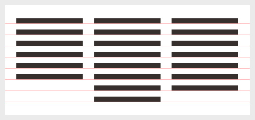
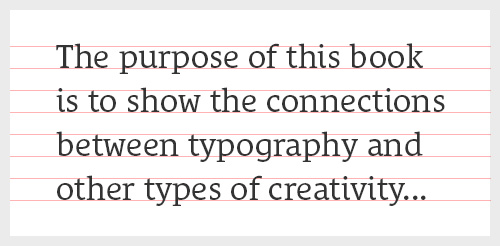
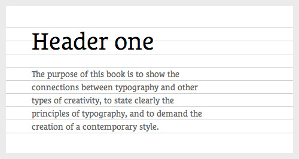
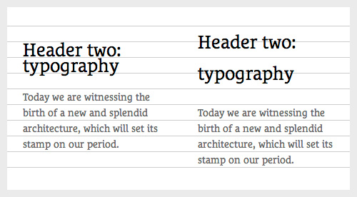
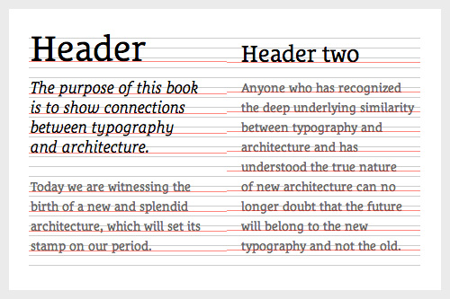
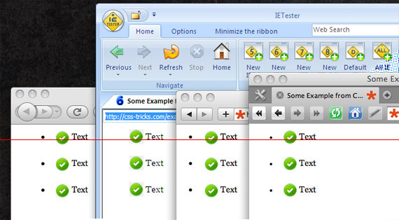

## 为什么baseline

为什么要使用baseline，baseline好比是垂直方向的网格，如果使用正确的话，能够恰到好处的保证段落和不同block的整齐：

这样除了能够保证文章的赏心悦目之外，还能保证阅读的流程，减少大脑的工作量，相比不整齐的baseline而言：

**但问题是在CSS中我们是无法控制baseline的**

比如在印刷设计中，我们看到的baseline是这样的：

## 通过line-height控制

但是在网页中，文本永远只能在显示在行中间位置，控制行高也只能通过`line-height`:

但是要通过各种技巧来调整对齐，比如要解决这种情况：

和这种情况：

## baseline现身

但是通过控制行内元素的`vertical-align`可以隐约的体现baseline

默认的`vertical-align`值就是`baseline`

可以对比`middle`的效果:

可以对比`text-bottom`的效果：

## 使用`line-height`让元素居中的原理

**行内元素的text永远都只能待在行内的居中位置！**

所以只要让行高充满整个容器就好了(但文本还是在中央)……但这样以来一旦换行就悲剧了！

每个元素都有默认的`line-height`，但这个值是`normal`

不同浏览器，不同平台，不同操作系统的这个`normal`值都可能不一样

暂时就想到这么多了

