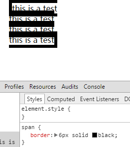
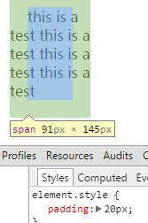

## inline

当行内元素从左至右延伸至折行产生了新的一行后，我们称之为产生了inline formatting context(相对于BFC:block formatting context)

- **height, width, and overflow** doesn't work on inline elements
- **margin-left, margin-right** 的用法参考float元素，它们可以把元素拉近或者推远
- **margin-top, margin-bottom** 通常被inline元素所忽略(这一点与上面的浮动元素不同)
- **border-top, border-bottom** 这两个属性通常不会影响行内元素的垂直方向位置，也不会影响影响行高

- **padding**：padding的影响规则与border一致，垂直方向不影响，只影响水平方向

