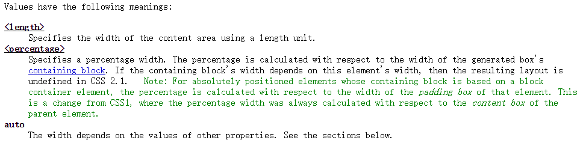
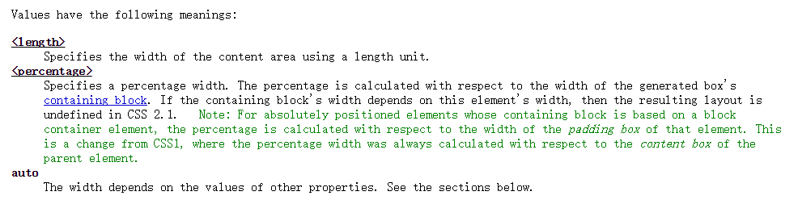

# 使用width和height的注意事项

## 提问

markup结构如下：

```
<body>
	<h1>Hello World</h1>
</body>
```

CSS样式：

```
h1 {
	height: 80%;
}
```

问此时`<h1>`的高度是否真的只占用`<body>`的80%？

## 答案

先说结论：

**错，此时`h1`高度仍然与`body`的高度相等**

解释：

- [Percentage Height HTML 5/CSS](http://stackoverflow.com/questions/1622027/percentage-height-html-5-css)
- [CSS – why doesn’t percentage height work?](http://stackoverflow.com/questions/5657964/css-why-doesn-t-percentage-height-work)

当你给一个块级元素（当然只能是块级元素，行内元素无法设置高度）设置高度时，它的父容器必须要指定高度（百分比，像素值都行）

## 引申

当你指定一个高或者宽为百分比单位时，百分比是相对于父容器宽度而言。

先说宽度，所有的块级元素在没有指定具体宽度数值的情况下都与他们的父容器同宽，往上追溯最终可以与`<html>`元素同宽，所以块级元素的宽度与它的内容（content）无关。例如

```
<body>
	<h1>Hello World</h1>
</body>
```
此时`h1`应该横跨整个浏览器的。

如果你此时设置`width:50%`，则立即生效，`h1`宽度减少为浏览器宽度的一半。

W3C中关于width的定义，留意percentage和auto部分：

;

高则不一样了

块级元素的高完全依赖于元素的内容，默认包裹住内容（`height:auto`），除非你指定了具体的高度。**并且**如果你想给高度指定一个百分比单位的话，必须给父元素也指定一个具体高度，才能让子元素的高度生效。

W3C中关于height的定义，留意percentage和auto部分：

;

总结来说，宽度默认跟随它的父容器宽度，高度默认跟随它的内容高度