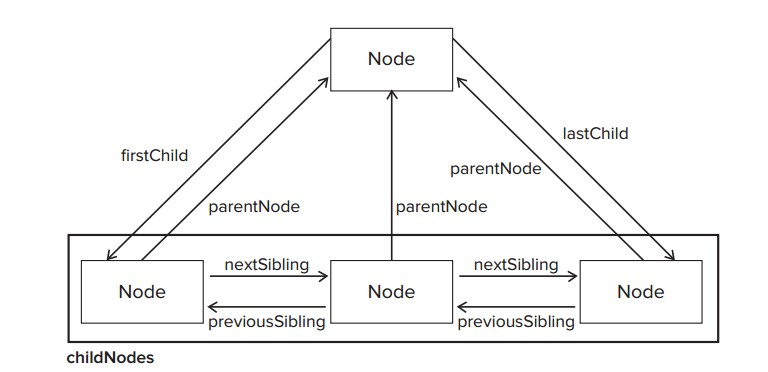

# DOM

## 目录

- [FAQ](#faq)
- [Node Relationships](#node-relationships)
- [Offset Dimensions](#offset-dimensions)
- [Client Dimensions](#client-dimensions)
- [Scroll Dimensions](#scroll-dimensions)

## FAQ    

- `insertBefore`如果只有一个参数用法如何？如何实现`insertAfter()`?
- `offsetParent` 和 `parentNode` 和 `parentElement` 有什么区别？
- 如何计算一个元素在页面上的位置(Page Coordation:offsetLeft/offsetTop)?
- Offset Dimensions和Client Dimensions哪个是会把scrollbar计算在内？ 
- document.documentElement vs document.body(in Internet Explorer 6 and earlier)

## Node Relationships



## Offset Dimensions

http://www.quirksmode.org/dom/w3c_cssom.html#elementview

- offsetHeight: The amount of vertical space, in pixels, taken up by the element, 
including its height, **the height of a horizontal scrollbar (if visible)**, the top border height, 
and the bottom border height.

- offsetWidth: The amount of horizontal space taken up by the element, including its 
width, **the width of a vertical scrollbar (if visible)**, the left border width, and the right 
border width.

- offsetTop: The number of pixels between the element’s outside top border and the 
containing element’s inside top border.

- offsetLeft: The number of pixels between the element’s outside left border and the 
containing element’s inside left border.

- **offsetParent**: When calculating the offsetParent of x the browser moves up the DOM tree to x's ancestors until it encounters one of the following elements. That element becomes x's offsetParent.
    - `<body>`
    - An element with a position other than static.
    - A `<table>`, `<th>` or `<td>`, but only if x has position: static.

### 如何计算一个元素在页面的位置(offsetLeft/offsetTop)

```
function getElementLeft(element){
    var actualLeft = element.offsetLeft;
    var current = element.offsetParent;
    while (current !== null){ 
        actualLeft += current.offsetLeft;
        current = current.offsetParent;
    }
    return actualLeft;
}

function getElementTop(element){
    var actualTop = element.offsetTop;
    var current = element.offsetParent;
    while (current !== null){ 
        actualTop += current.offsetTop;
        current = current.offsetParent;
    }
    return actualTop;
}
```

## Client Dimensions

http://www.quirksmode.org/mobile/tableViewport_desktop.html
http://www.quirksmode.org/dom/w3c_cssom.html

- clientWidth: the width of the content area plus the width of both the left and the right padding.
- clientHeight: the height of the content area plus the height of both the top and the bottom padding.

The client dimensions are literally the amount of space inside of the element,so the **space taken up by scrollbars is not counted**.

Determine the browser viewport size:

```
function getViewport(){

    var viewport = document.documentElement || document.body;
    return {
        width: viewport.clientWidth,
        height: viewport.clientHeight
    }; 
}
```


## Scroll Dimensions

- scrollHeight: The total height of the content if there were no scrollbars present.

- scrollLeft: The number of pixels that are hidden to the left of the content area. This property can be set to change the scroll position of the element.

- scrollTop: The number of pixels that are hidden in the top of the content area. This property can be set to change the scroll position of the element.

- scrollWidth: The total width of the content if there were no scrollbars present.

对document来说，clientWidth和scrollWidth应该是差不多的结果，**但是不同浏览器的实现不同**

- Firefox keeps the properties equal, but the size is related to the actual size of the document content, not the size of the viewport.

- Opera, Safari 3.1 and later, and Chrome keep the properties different, with scrollWidth and scrollHeight equal to the size of the viewport and clientWidth and clientHeight equal to the document content.

- Internet Explorer (in standards mode) keeps the properties different, with scrollWidth and scrollHeight equal to the size of the document content, and clientWidth and clientHeight equal to the viewport size.

**解决方案**

```
var docHeight = Math.max(document.documentElement.scrollHeight, document.documentElement.clientHeight);
var docWidth = Math.max(document.documentElement.scrollWidth, document.documentElement.clientWidth);
```