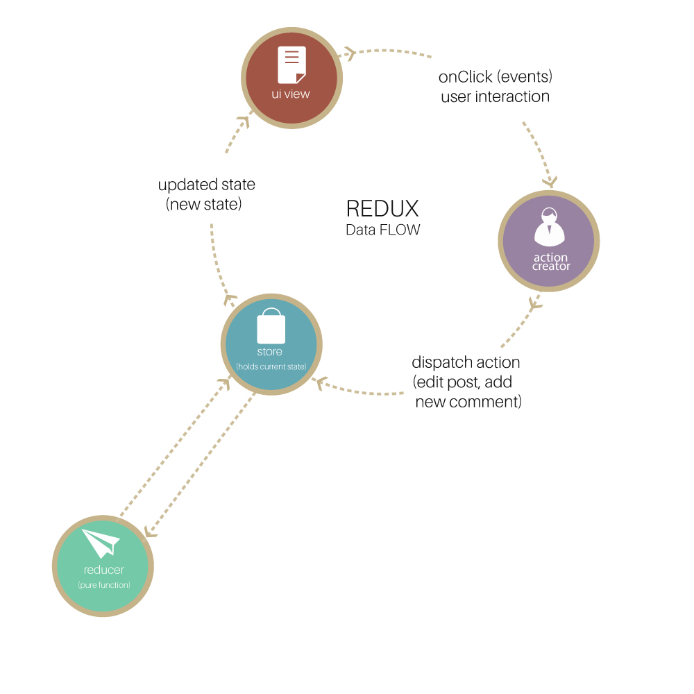

# 前端面试大全

## 重点基础题

- 什么是闭包？有什么作用？（什么是作用域链？）
- 解释Javascript的继承（原型链）的原理
    - 如何实现多态（Polymorphism）？
    - 如何实现封装（Encapsulation）？
- 为什么CSS3的效率更高？
- 为什么React的Virtual DOM的效率更高？
- setTimeout 与 setInterval
 
## React & Flux & Vuex

 React解决了什么问题
- **如何设计一个好的组件？**
- **组件的Render函数在何时被调用？**
    - 调用时DOM就一定会被更新吗？
- 组件的生命周期有哪些？
    - 当某些第三方类库想对DOM初始化，或者进行远程数据加载时，应该在哪个周期中完成？
    - 在哪些声明周期中可以修改组件的state？
- **不同父节点的组件需要对彼此的状态进行改变时应该实现？**
    - 如何设计出一个好的Flux架构
    - 如何设计出一个好的React组件
- 如何进行优化？
    - 组件中的key属性有什么用？
- Component 与 Element 与 Instance 的区别
- **Flux VS Vuex**
    - Flux结构与Vuex架构有什么区别？
    - Vue.js 的双向绑定是如何实现的？
- **Flux VS Redux**
    - Flux结构与Redux架构的区别
        - 解释一下reducer，比如reducer有哪些特征
    - 解释一下connect的作用
    - 解释一下Redux的中间件
        - 中间件可以解决什么问题？
        - redux-thunk的作用是什么
- Webpack如何打包输出多个文件？
    - webpack打包时如何工作的？
        - 如何解决循环引用的问题
    - 在什么情况下需要打包输出多个文件？
    - loader和plugin的差别
    - 你觉得使用过什么高级技巧吗？
- （开放问题）React的生态你使用过哪些类库
    - Immutable
    - Redux-thunk

## 重点答案

### 如何设计一个好的组件

从两个维度看这件事
1. 感性（组件的目标）
    感性上来说，假设你开发了一个组件，当另一个人想要使用你的组件的时候他应该是根据文档无障碍的，你的功能是完全满足他期待的，他不需要在使用组件的时候做二次开发
2. 理性（从概括到具体）
    - SOLID 原则
        - **S: 单一职责**，一个组件只做一件事，支持以**组合**的方式组成另一个组件
        - **O: 对拓展开放**，对修改关闭（对组件的封装）。后端语言是通过继承特性来实现的，而在组件中则可以通过添加 hook 函数，开放自定义样式等实现
        - 接口隔离（对开发组件有启示）
        - 反转依赖（对开发组件有启示）
    - React 官方提倡 Hight Order Component，或者使用 Container Component，将 Container Component 与 Presentional Component 分离
    - 在实现内部使用设计模式
    - 保持好的代码习惯

### Vuex与Redux架构




### 什么是闭包

- 闭包是指函数能够访问另一个函数内的变量 (Closures are functions that have access to variables from another function’s scope, Professional Javascript for Web Developers 3rd Edition)
- 闭包是指当函数定义时能够访问并且操纵函数外部的变量 (A closure is the scope created when a function is declared that allows the function to access and manipulate variables that are external to that function.(Secrets of the Javascript Ninja))

### 继承的原理


在Javascript中每一个对象都有一个**原型（Prototype）**，当你想访问一个对象的属性时，Javascript首先会在对象自己内部查找（hasOwnPrototype），如果失败了会去对象的原型上查找，如果还是查找失败了，则会继续在原型的原型对象上查找。并以此类推。`Object.create`用于创建一个prototype是指定对象的空对象

每一个（构造）函数也有自己的prototype，prototype指向（或者说是）一个对象，当使用new关键字调用构造函数生成实例后，实例的prototype即指向函数的prototype所指向的对象。

所有的prototype属性都有一个名为constructor的属性，指向拥有prototype的函数。每当用构造函数创建一个实例时，实例的[[Prototype]]属性便指向构造函数的prototype属性。每一个对象都有一个__proto__的属性，表示实例与构造函数的prototype属性之间的关系（而并非实例与构造函数之间的关系）

### 多态

首先什么是多态：同一操作作用于不同的对象，可以有不同的解释，产生不同的执行结果。比如对黑白打印机执行打印操作后，打印效果是黑白的，而对彩色打印机进行打印操作后，打印效果是彩色的。

多态最常见的2种实现方式：1.覆盖，2.重载

覆盖指子类重新定义父类方法，这正好就是基于prototype继承的玩法，这不就多态了么。
重载是指多个同名但参数不同的方法，这个JavaScript确实没有。[参考](https://www.zhihu.com/question/33596850)

### 封装

通过IIFE（Immediately Invoking Function Expression）实现，同时也是利用闭包和scope chain（在Javascript中，变量只能是函数级别或者全局级别的，并且函数内可以的可以访问函数外部的，外部不能访问内部的）。

IIFE把私有变量定义在函数内部，执行完毕之后返回访问器。所以你只能通过访问器去访问变量，而无法直接访问变量

```javascript
(function() {
  const private = 'private';
  return {
      getter() {
          return private;
      }
  }
})(this);
```


